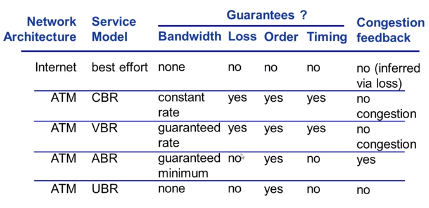
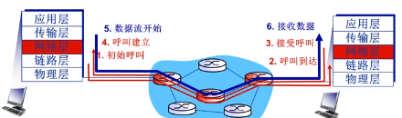
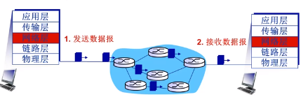
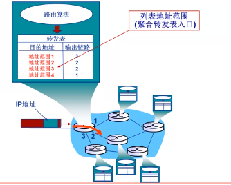
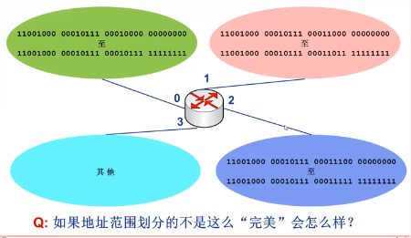
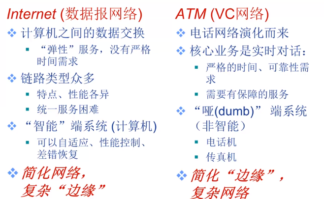
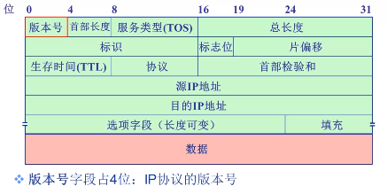

# 网络层

## 第一讲

### 网络层概述

* 从发送主机向接收主机传送数据段(segment)
* 发送主机：将数据段封装到数据报(datagram)中
* 接收主机：向传输层交付数据段(segment)
* **每个**主机和路由器都运行网络层协议
* 路由器检验所有穿越它的IP数据报的头部域
  * 决策如何处理IP数据报

### 网络核心功能-转发和路由

* **转发：**将分组从路由器的输入端口转移到合适的输出端口(这个过程通过路由器中的转发表实现)
* **路由:**确定分组从源到目的经过的路径
  * 路由算法确定通过网络的端到端路径(如何选择好的路径)
  * 转发表确定在本路由器如何转发分组(将转发的路径与路由器端口对应)

### 网络层核心功能-连接建立

* 连接建立**只是某些**网络的重要功能
  * ATM 帧中继  X.25
* 数据分组传输之前两端主机需要首先建立虚拟/逻辑连接
  * 网络设备(如路由器)参与连接的建立
* 网络层连接与传输层连接的对比：
  * 网络层连接：两个主机间(路径上的路由器等网络设备参与其中)
  * 传输层连接：两个应用进程之间(对中间网络设备透明)

### 网络层服务模型

* 不同网络协议提供不同服务：

* 无连接服务(connection-less service):
  * 不事先为系列分组的传输确定传输路径
  * 每个分组独立确定传输路径
  * 不同分组可能传输路径不同
  * **数据报网络(datagram network)**
* 连接服务(connection service)
  * 首次为系列分组的传输确定从源目的经过的路径(建立连接)
  * 然后沿该路径(连接)传输系列分组
  * 系列分组传输路径相同
  * 传输结束后拆除连接
  * **虚电路网络(virtual-circuit network)**

## 第二讲

### 连接服务与无连接网络

* 数据报网络与虚电路网络是典型两类分组交换网络
* 数据报网络提供网络层无连接服务
* 虚电路网络提供网络层连接服务
* 类似于传输层的无连接服务(UDP)和面向连接服务(TCP)，但是网络层服务：
  * 主机到主机服务
  * 网络核心实现

### 虚电路网络

* 虚电路：一条从源主机到目的主机，类似于电路的路径(逻辑连接)
  * 分组交换(**与电路的差别**)
  * 每个分组的传输利用链路的全部带宽(**与电路的本质差别**)
  * 源到目的路径经过的网络层设备共同完成虚电路功能
* 通信过程：(术语借鉴**电路中的术语**)
  * 呼叫建立(call setup)(**这时为每个链路提供一个标识VCID**) --> 数据传输 --> 拆除呼叫
* 每个分组携带虚电路标识(VCID),而不是目的主机
* 虚电路经过的**每个**网络设备(如路由器)，维护**每条**经过它的虚电路连接状态
* 链路、网络设备资源(如宽带、缓存等)可以面向VC进行预分配
  * 预分配资源=可预期服务性能
  * 如ATM的电路仿真(CBR)

### VC的具体实现

* 首先确定路径，每条电路包括：
  1. 从源主机到目的主机的**一条路径**
  2. **虚电路号（VCID）**，沿路每段链路一个编号。(因为不同链路的带宽导致建立的虚电路路径条数不同，所以不同链路支持建立不同虚电路的数量不同，因此支持的虚电路号也就不同，因此虚电路号采取**局域化管理，即从源主机到目的主机在不同链路上的虚电路号不同**)
  3. 沿路每个网络设备(如路由器)，**利用转发表记录经过的每条电路**
* 沿某条虚电路传输的分组，携带对应虚电路的VCID,而不是目的主机
* 同一条VC,在每段链路上的VCID通常不同
  * 路由器转发分组时依据转发表改写/替换虚电路号
* **VC路径上每个路由器都需要维护VC连接的状态信息**

### 虚电路信令协议(signaling protocols)

* 用于VC的建立、维护与拆除
  * 路径选择
* 应用于虚电路网络
  * 如ATM、帧中继(frame-relay)网络等
* 目前的Internet不采用

### 数据报网络

* 网络层提供无连接
* 每个分组携带目的地址
* 路由器根据分组的目的地址转发分组
  * 基于路由协议/算法构建转发表
  * 检索转发表
  * 每个分组独立选路

### 数据报转发表

* **最长前缀匹配优先原则进行匹配**

### 数据报网络 or VC网络

## 第三讲

### Internet网络
* 主机、路由器网络层主要功能：
  1. 路由协议：
    * 路径选择
    * RIP,OSPF,BGP
  2. 转发表
  3. IP协议
    * 寻址规约(conventions)
    * 数据报(分组)格式
    * 分组处理规约
  4. ICMP协议
    * 差错报告
    * 路由器"信令"

### IP数据报(分组)格式
| IP|数据报格式 |
|:-:|:-:|
| 首部 | 数据(eg.TCP、UDP段) |

* 分组格式
  * **版本号**字段占4bit: IP协议的版本号
    * E.g.4 --> IPv4, 6 --> IPv6
  * **首部长度**字段占4bit: IP分组首部长度
    * **以4字节为单位**
    * E.g --> IP首部长度为20 (5x4) 字节
  * **服务类型(QoS)**字段占8bit：指示期望获得哪种类型的服务
    * 1998年更名为**区分服务**
    * 只有在网络提供区分服务是使用
    * 一般情况下不使用，通常IP分组的该字段(第2字节)的值为 **00H**
  * **总长度**字段占16bit：IP分组的总字节数(首部+数据)
    * 最大IP分组的总长度：65535B
    * 最大的IP分组首部：20B
    * IP分组可以封装的最大数据：65535-20=65515B
  * **生存时间(TTL)**字段占8bit：IP分组在网络中可以通过的路由器数(或跳步数)
    * 路由器转发一次分组，TTL减1
    * 如果TTL=0，路由器则丢弃该IP分组
  * **协议**字段占8bit：指示IP分组封装的是哪个协议的数据包
    * 实现复用/分解
    * E.g 6为TCP,表示封装的TCP段：17为UDP,表示封装的是UDP数据报
  * **首部校验和**字段占16bit：实现对IP分组首部的差错检测
    * **计算校验和时，该字段置全0**
    * 采用反码算数运算求和，和的反码作为首部校验和字段
    * 逐跳计算、逐跳校验
  * **源IP地址、目的IP地址**字段各占32bit: 分别标识发送分组的源主机/路由器(网络接口)和接收分组的目的主机/路由器(网络接口)的IP地址
  * **选项**字段占长度可变，范围在1~40B之间：携带安全、源选路径、时间戳和路由记录等内容
    * 实际上很少被占用
  * **填充**字段占长度可变：范围在0~3B之间：目的时补齐整个首部，符合32位对其，即保证首部成都是4字节的倍数
  * **标识**字段占16bit：标识一个IP分组
    * IP协议利用一个计数器，每产生IP分组计数器加1，作为该IP分组的标识
  * **标志位**字段占3位：  |保留|DF|MF
    * DF(don't fragment)  
      * DF = 1 : 禁止分片
      * DF = 0 ：允许分片
    * MF(More fragment)
      * MF = 1 ：非最后一片
      * MF = 0 ：最后一片(或未分片) (通过片偏移区分)
  * **片偏移**字段占13bit: 一个IP分组分片封装原IP分组数据的相对偏移量
    * 片偏移字段以**8bit为单位**
    * 除了最后一片前面的数据都是8的倍数

### IP协议-分片
* 最大传输单元(MTU)
  * 网咯链路存在MTU(最大传输单元)--链路层数据帧可封装数据到的上限
    * 不同链路的MTU不同
    * 如果 前面的MTU>后面的MTU **则可以分片**
* 大IP分组向较小MTU链路转发时，**可以**被"分片"
  * 1个IP分组分为多片IP分组
  * IP分片到达目的主机后进行“重组”
* IP首部的相关字段(**总长度、标识、标志位和片偏移字段**)用于标识分片以及确定分片的相对顺序
  * 如果有一片没有到达，则目的主机会等一会，如果还没到达就将得到的所有分片都丢掉

### IP编址
* IP分组
  * 源地址(SA)-从哪儿来
  * 目的地址(DA)-到哪儿去
* **接口:**主机/路由器与物理链路的连接
  * 实现网络层功能
  * 路由器通常有多个接口
  * 主机通常由一个或两个接口(eg.有线的以太网接口，无线的802.11接口)
* IP地址：32bit(IPv4),编号标识主机、路由器的接口
* IP地址：
  * 网络号--高位比特
  * 主机号--低位比特
* IP子网：
  * IP地址具有相同网络号的设备接口
  * 不跨越路由器可以彼此物理联通的接口

