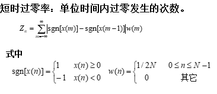
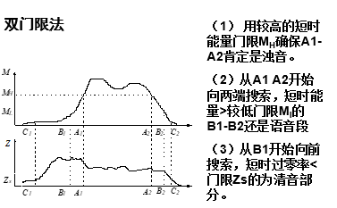

## 提取语音信号的特征值

### 主要包含如下三种操作
* 提取短时能量
* 计算短时过零率
* 端点检测(去静音)

>使用python

### 短时能量的提取

#### 相关概念
##### 分帧
* 什么是分帧：
    * 将语音信号的采样点分为多少个采样点为一份，这一份就是一帧
* 一帧的大小：
    * 一般一帧大小为10ms~30ms内采样点的个数

##### 加窗
* 什么是加窗：
    * 对语音信号进行处理时，我们对其进行分帧后，并将这一段用函数进行处理，这个过程就叫做加窗。
* 为什么要加窗：
    1. 语音信号在短时间内具有周期性
    2. 我们的计算机只能处理有限长度的信号，因此需要对原始信号进行截断，使其限化。
* 有哪些常用窗函数：
    * 矩形窗(方窗)
        
    * 哈明窗
        
    * 哈宁窗
        
* 如何加窗：
    * 在时域中：
    * 用窗函数与原每帧的语音信号函数相乘(即对应的函数值直接相乘)
    * 在频域中：用窗函数与原每帧的语音信号函数进行卷积运算。
* 分帧与加窗的关系：
    * 一般帧长就等于窗长
    * 另外连续的看，我们拿到一个语音信号后，将其分成一帧一帧的，然后使用窗函数对得到的每帧都行进处理，处理后得到新的每帧语音信号。这真个过程就已经包括了分帧的加窗。

#### 短时能量计算公式

#### python计算短时能量代码

```
# 该公式只能记录单声道语音一帧的短时能量
def caculateE(wavData):   # 传入的wavData为一个 1 x n 矩阵 (即n个采样点)
    temp = np.array(wavData[0])
    wavData = temp.tolist()
    frameNum = len(wavData)//windowWidth #计算帧的个数，最后不足的舍弃
    E = [0]*frameNum
    for i in range(frameNum):
	# 自己写的的窗函数，根据传入的tpye决定使用什么窗函数
        data = addWindow(type,wavData[i*windowWidth:(i+1)*windowWidth])
        for j in range(windowWidth):
            E[i]+=data[j]**2
    return E

```

### 短时过零率的计算
#### 什么是短时过零率
短时过零率 (zero-crossing rate,ZCR)是指一个信号在一个单位时间内符号变化的比率，例如信号从正数变成负数或反向。**在这里我们分别就算每帧的过零率**
#### 计算过零率的公式
    
#### 计算过零率的python代码
```
# 只计算单声道
def caculateZeroCrossRate(wavData):  # 传入的wavData为一个 1 x n 矩阵
    temp = np.array(wavData[0])
    wavData = temp.tolist()
    frameNum = len(wavData)//windowWidth #分的帧数
    Rate = [0]*frameNum
    for i in range(frameNum):
	# 自己写的的窗函数，根据传入的tpye决定使用什么窗函数
        data = wavData[i*windowWidth:(i+1)*windowWidth]
        for j in range(1,windowWidth):
            Rate[i]+=0.5*(math.fabs(sgn(data[j-1])-sgn(data[j])))
        Rate[i] /= windowWidth
    return Rate
```

### 端点检测
#### 什么是端点检测
即将语音的部分与外界的噪音或是静音分割开来，以减少计算机的计算负担，从而更快进行识别
#### 端点检测使用的算法
1. 双门限法
    
2. 短时自相关函数法

#### python实现端点检测
```
# 这里使用双门限法，并对其进行了一点小小的改进
def endPointDetection(data,Mh,Ml,Zs):
    E_get = []          #因为一个语料中可能出现多个间断有语音的情况，所以使用E_get存储每个"峰"的起始和结束
                        #其记录的帧数为[2*i,2*i+1)

    R_getLoss = []      #这是在使用双门限后决定丢弃帧数
    flag = False        #能量门限使用的辅助变量
    begin = 0           #过零率门限使用的辅助变量
    E = caculateE(data)   #每帧能量
    R = caculateZeroCrossRate(data) #每帧过零率

    #使用能量Mh进行限定
    for i in range(E.__len__()):
        if E[i] > Mh and flag==False:        #记录每个峰的开始位置
            E_get.append(i)
            flag = True
        if E[i] < Mh and flag ==True:        #记录结束位置
            E_get.append(i)
            flag = False
    if flag == True:                       #如果最后一帧没有结束就处理一下
        E_get.append(E.__len__())

    #使用Ml进行限定
    for i in range(E_get.__len__()//2+1):
        #每次对两个峰间的数据进行判断，如果小于界限就放到待丢失帧数组中
        if(i == 0):
            begin = 0
        else:
            begin = E_get[2*i-1]
        if(i == E_get.__len__()//2):
            end = R.__len__();
        else:
            end = E_get[2*i]
        for j in range(begin,end):
            if(E[j]<Ml):
                R_getLoss.append(j)

    # 对待丢失的数据进行过零率分析判断，如果小于Zs就判断为清音，留下，不剔除

    # 对于等于0的剔除(这一步是双门限法原来所没有的，在做实验时，发现这一步添加后去静更好)
    for i in R_getLoss:
        if(R[i] < Zs and R[i]!=0):
            R_getLoss.remove(i)

    temp =  [x for x in range(len(E)) if x not in R_getLoss]

    result = []
    for i in temp:
        for j in range(windowWidth):
            result.append(data[0][i*windowWidth+j])
    return result

```