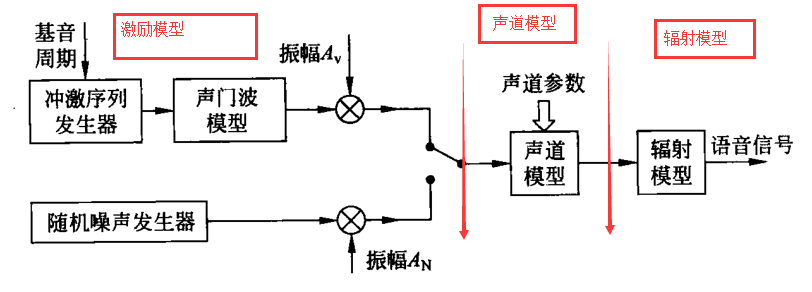

# 主要讲语音信号的模型
>主要讲记录语音信号的模型

### 人的发声
##### 人发出的声音有两种：
* 浊音： 浊音的发生需要声带的震动
* 清音： 清音的发生不需要声带的震动

##### 人发出声音经历的生物过程 --> 对应的模型
* 肺部的气流和声带共同作用形成的激励  ----> 激励模型
* 声道的调音运动                    ----> 声道模型
* 嘴唇和鼻孔的辐射效应               ----> 辐射模型

###### 对应的关系如下图所示

### 激励模型
人在发不同声时，激励的情况不同，但是大致分为两类：
* 浊音：气流通过绷紧的声带，对声带进行冲击产生振动，声门处形成准周期的脉冲串。声带的绷紧程度不同，震动频率**(基音频率)**不同，故基音周期也不同。这时声源的振动产生的脉冲波类似斜三角形的脉冲

